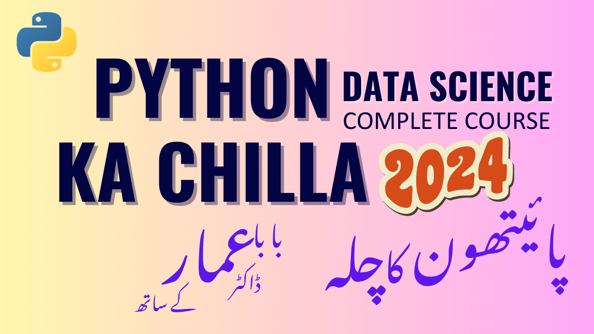

# Python Ka Chilla 2024

> ## **Introduction**
This is a repository for the Python Ka Chilla 2024. This repository contains all the resources and code snippets that are used in the Python Ka Chilla 2024.

> ## **Registration**
Python ka chilla 2024  You can now register for Python ka chilla 2024 which is starting from 01.10.2024. This is a paid course which you can register and find more information at the [following link.](https://forms.gle/kUU3eZJsFRb7Cn6r8) 

> ## **LMS for the Course**
More details about the course can be found in the following link for Learning Mangement System **`(LMS)`** of the Course with all the video lectures: [Python Ka Chilla 2024](https://codanics.com/courses/python-ka-chilla-2024/)

> ## **`Course Instructor:`**

<h1 style="font-family: 'poppins'; font-weight: bold; color: Green;">👨‍💻Author: Dr. Muhammad Aamamr Tufail</h1>

 
 
  

 
 
  

 
 

For any query

contact: info@codanics.com

---
---

## **Our youtube channel:**

Our Daily Lectures are available on our youtube channel. Please subscribe to our channel and find all lectures on youtube as well. [Here is the link playlist for this course](https://www.youtube.com/watch?v=NrAyNt7EQ4c&list=PL9XvIvvVL50Gtj1fmwUhUW69e0U-TZZaZ&ab_channel=Codanics)

visit our website for more details:
[www.codanics.com](https://www.codanics.com/)
---